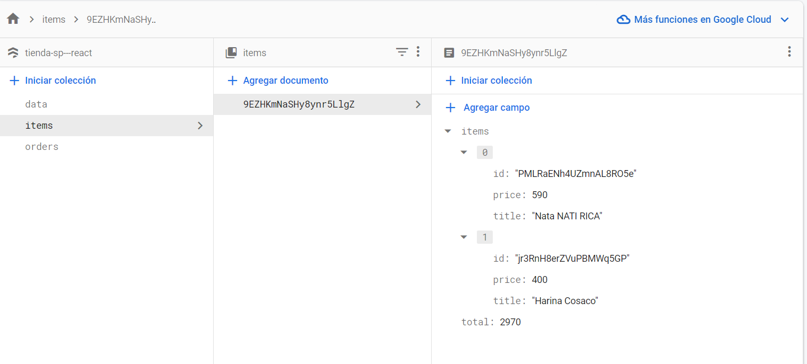
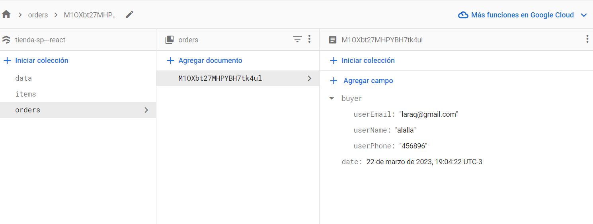

# E-commerce con React

---
## Descripcion:

Pagina Web para realizar compras de productos importados del caribe, 
donde puedes ejecutar una compra y obtener un ID desde FIREBASE para tu comprar final!

---
## Esta compuesto por 15 componentes principales: 
* Home
* NavBar
* Footer
* AboutUs
* ItemListConteiner
* ItemList
* Item
* ItemDetail
* ItemDetailContainer
* ItemCount
* CartWidget
* Cart
* CartContext
* SendOrder(contact form)
* Brief

---

### ¿Cómo Funciona? :
![GIF] (Proyect-React.gif)
---

